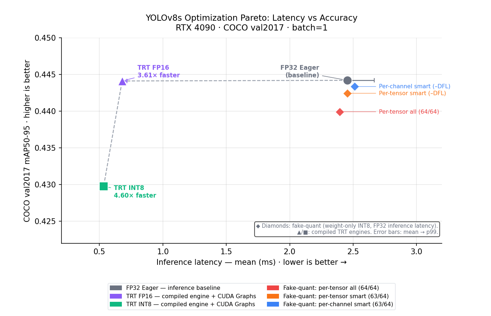
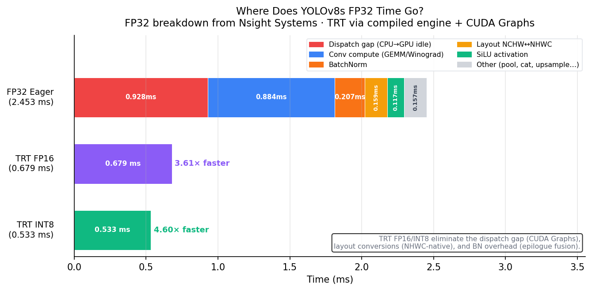
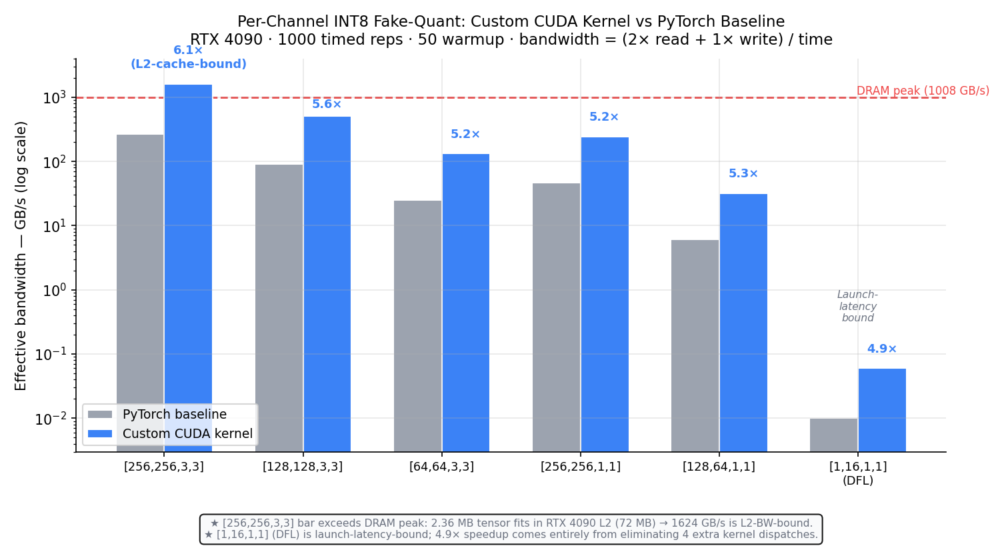
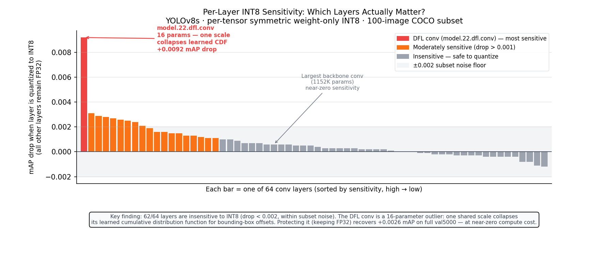

# YOLOv8s Inference Optimization

**How fast can YOLOv8s go on an edge GPU — and what actually limits it?**

This project builds a ground-up inference optimization stack for YOLOv8s on an RTX 4090.
Each experiment is driven by profiling data from the previous one: measure the bottleneck,
understand it, then eliminate it. Every result is measured on hardware and traces back to
a committed artifact.

[](LICENSE)


---

## Key Results

| Configuration | Latency (mean) | p99 | mAP50-95 | vs FP32 |
|---|---|---|---|---|
| FP32 Eager (PyTorch baseline) | 2.453 ms | 2.668 ms | 0.4442 | — |
| TRT FP16 (compiled + CUDA Graphs) | 0.679 ms | 0.718 ms | 0.4441 | **3.61× faster, −0.0001 mAP** |
| TRT INT8 (compiled + CUDA Graphs) | 0.533 ms | 0.537 ms | 0.4298 | **4.60× faster, −0.0144 mAP** |

*Measured on RTX 4090 (Ada, 24 GB). COCO val2017, 5000 images. All artifacts in [`results/`](results/).*

**The 3.61× FP16 speedup exceeds the 2× FP16 arithmetic ceiling** because precision is not the bottleneck.
Profiling revealed that 37.8% of FP32 wall-clock time is CPU→GPU dispatch latency, 10.4% is redundant
NCHW↔NHWC layout transposes, and 13.6% is BatchNorm running as a separate kernel pass.
TensorRT eliminates all three via CUDA Graphs, layout fusion, and BN epilogue fusion — with zero
algorithmic change to the model.

**A custom per-channel INT8 CUDA kernel cuts QAT simulation overhead 7.1×** (3.4 ms → 0.5 ms per
fake-quant pass) and recovers 81% of the per-tensor accuracy gap (0.4434 vs 0.4399 mAP50-95).
Note: this kernel is a weight-only fake-quantization harness used during quantization
experimentation — it does not run in the deployed inference path. The deployed TRT INT8 engine
uses TRT's own PTQ calibration (weights + activations), which is why TRT INT8 shows a larger
accuracy gap (−0.0144) than fake-quant alone (−0.0008).

---

## Figures

| | |
|---|---|
|  | **Latency–Accuracy Pareto.** Compiled TRT engines (triangle/square) move left along the frontier. Fake-quant diamonds show the accuracy impact of different quantization policies at FP32 inference latency. Error bars are mean→p99. |
|  | **Where the 2.453 ms goes.** Dispatch gap (red, 37.8%) is the single largest cost — larger than all convolution kernels combined. TRT FP16 eliminates it entirely. |
|  | **Custom CUDA kernel vs PyTorch.** 5–6× speedup across all shapes. The [256,256,3,3] bar exceeding DRAM peak (161%) is correct: the tensor fits in L2 cache (2.36 MB vs 72 MB L2). |
|  | **Per-layer INT8 sensitivity sweep.** Each bar is one of 64 conv layers quantized individually. 62/64 layers are within the noise floor. The DFL conv (16 parameters, red) is the sole outlier — its 16 weights share one scale, collapsing the learned bounding-box offset CDF. Protecting it costs nothing and recovers +0.0026 mAP. |

*Figures generated from committed JSON artifacts: `python scripts/make_figures.py`*

---

## Experiments

### 1. FP32 Baseline — Establish the measurement foundation

Before optimizing anything, establish a reliable latency and accuracy baseline with correct
measurement methodology: CUDA event timing (not wall-clock), 50-iteration warmup to clear JIT
and cuDNN algorithm selection, and full COCO val2017 (5000 images) for accuracy.

**FP32 eager baseline:** 2.453 ms mean, 2.668 ms p99, 0.4442 mAP50-95.

The p99/mean spread (8.8%) reflects CPU dispatch variance — each iteration re-runs Python dispatch
and cuDNN algorithm lookup. This variance is itself a signal: a deterministic execution path would
show much tighter distribution.

→ [`results/fp32_latency.json`](results/fp32_latency.json), [`results/fp32_accuracy.json`](results/fp32_accuracy.json)

### 2. Overhead Profiling — Quantify where the time goes

Nsight Systems timeline capture (50 warmup iterations outside the capture window, 20 iterations
captured) reveals a critical gap: GPU kernels account for only 1.525 ms/iter, but wall-clock is
2.453 ms. The 0.928 ms gap (37.8%) is the CPU sitting idle dispatching the next kernel while the
GPU has already finished the previous one.

**Three bottlenecks identified:**

| Overhead | ms/iter | % of wall-clock | Root cause |
|----------|---------|-----------------|------------|
| Dispatch gap | 0.928 | 37.8% | ~288 kernel launches, CPU-driven |
| Layout transposes | 0.159 | 6.5% | 54 `nchwToNhwcKernel` calls per pass |
| Separate BatchNorm | 0.208 | 8.5% | 57 BN launches, not fused to conv |

Crucially: **INT8 alone would not eliminate the dispatch gap.** Quantized kernels run faster,
which makes dispatch overhead a *larger* fraction of the total. The fix must be graph-level.

→ [`results/profile_nsys_stats.txt`](results/profile_nsys_stats.txt), [`docs/profiling_analysis.md`](docs/profiling_analysis.md)

### 3. Quantization Sensitivity — Which layers actually matter?

Before writing any quantization code, run a per-layer sensitivity sweep: quantize one layer
at a time to INT8 (all others stay FP32) and measure mAP impact on a 100-image subset.

**The non-obvious finding:** The large backbone 3×3 conv layers that dominate GPU time are nearly
insensitive to per-tensor INT8 (mAP drop < 0.001). The `model.22.dfl.conv` layer — 16 parameters,
essentially free to protect — is uniquely fragile: its 16 weights share one scale, collapsing the
learned cumulative distribution function for bounding-box coordinate offsets.

Protecting only DFL (63/64 layers quantized) recovers +0.0026 mAP at essentially zero compute cost.

→ [`results/quant_sensitivity.json`](results/quant_sensitivity.json), [`docs/quantization_analysis.md`](docs/quantization_analysis.md)

### 4. Custom CUDA Kernel — Accelerate QAT experimentation

Per-channel quantization assigns one scale per output filter (addresses DFL scale-collapse),
but PyTorch's per-channel fake-quant dispatches 5–6 separate ops per tensor. Across 64 conv
layers in a QAT forward pass, this compounds to 3.4 ms/iter — 138% of inference time itself.

A custom CUDA kernel fuses the entire operation (abs, max-reduce, scale, round, clamp, multiply)
into a single launch: 2 reads + 1 write instead of 5–6, hitting L2-cache bandwidth on the large
backbone layers.

**Result:** 5–6× throughput improvement per shape; total QAT overhead drops from 3.4 ms to
0.5 ms per forward pass. Per-channel accuracy: 0.4434 mAP (vs 0.4399 per-tensor all, 0.4442 FP32).

→ [`results/kernel_benchmark.json`](results/kernel_benchmark.json), [`results/kernel_perchannel_eval.json`](results/kernel_perchannel_eval.json), [`docs/kernel_analysis.md`](docs/kernel_analysis.md)

### 5. TensorRT Deployment — Compile-path optimization

TensorRT directly eliminates the three bottlenecks identified in profiling:

- **CUDA Graphs** eliminate the 0.928 ms dispatch gap — the entire kernel sequence is pre-recorded,
  no CPU involvement between launches
- **NHWC-native layout** eliminates the 54 `nchwToNhwcKernel` transposes
- **BN epilogue fusion** absorbs the 57 BatchNorm launches into the preceding conv kernels at compile time

**TRT FP16: 0.679 ms, 3.61× faster, −0.0001 mAP.** The 3.61× speedup exceeds the 2× FP16
arithmetic ceiling — the structural wins (dispatch, layout, BN) compound with the precision win.

**TRT INT8: 0.533 ms, 4.60× faster, −0.0144 mAP.** The larger accuracy gap vs fake-quant
(−0.0144 vs −0.0008) is explained entirely by activation quantization: TRT INT8 calibrates
activations at every inter-layer boundary, adding a second noise source on top of weight discretization.

The INT8 std of 0.001 ms (vs FP32 0.217 ms) directly confirms CUDA Graphs operation — the replay
is deterministic, iteration-to-iteration variance reflects only GPU thermal jitter.

→ [`results/trt_fp16_latency.json`](results/trt_fp16_latency.json), [`results/trt_int8_latency.json`](results/trt_int8_latency.json), [`docs/tensorrt_analysis.md`](docs/tensorrt_analysis.md)

---

## Quantization Accuracy Progression

| Config | mAP50-95 | Δ vs FP32 | Note |
|--------|----------|-----------|------|
| FP32 baseline | 0.4442 | — | |
| Per-tensor all (64/64 conv) | 0.4399 | −0.0043 | DFL scale collapse |
| Per-tensor smart (63/64, DFL excluded) | 0.4425 | −0.0017 | Skip problem layer |
| **Per-channel smart (63/64, DFL excluded)** | **0.4434** | **−0.0008** | One scale per filter |
| TRT FP16 | 0.4441 | −0.0001 | |
| TRT INT8 (weights + activations) | 0.4298 | −0.0144 | Activation quant compounds |

The gap between per-channel fake-quant (−0.0008) and TRT INT8 (−0.0144) is entirely
from activation quantization. Fake-quant simulates weight-only quantization noise;
TRT INT8 also quantizes activations layer-by-layer, which compounds the error.

---

## Quick Start

```bash
git clone https://github.com/PatrickKollman/inference-codesign.git
cd inference-codesign
pip install -r requirements.txt
```

**Regenerate figures** (no GPU required — reads committed JSON artifacts):
```bash
python scripts/make_figures.py
# → figures/fig1_pareto.png, fig2_profiling.png, fig3_kernel.png, fig4_sensitivity.png
```

**Run tests** (CPU/MPS — no GPU required):
```bash
pytest tests/ -v
```

**Full reproduction on RunPod** (RTX 4090, CUDA 12.x): see [`docs/REPRODUCE.md`](docs/REPRODUCE.md)

---

## Project Structure

```
.
├── docs/
│   ├── profiling_analysis.md     # Nsight profiling results, roofline, overhead breakdown
│   ├── quantization_analysis.md  # Per-layer sensitivity, DFL finding, Pareto
│   ├── kernel_analysis.md        # Kernel design, benchmark, accuracy results
│   ├── tensorrt_analysis.md      # TRT pipeline, Pareto, ASIC transfer reasoning
│   └── REPRODUCE.md              # Full reproduction guide: pod setup + every command
├── figures/                      # Portfolio figures (committed PNG outputs)
│   ├── fig1_pareto.png           # Latency–accuracy Pareto
│   ├── fig2_profiling.png        # FP32 overhead breakdown + TRT comparison
│   ├── fig3_kernel.png           # Custom CUDA kernel throughput + roofline
│   └── fig4_sensitivity.png      # Per-layer INT8 sensitivity sweep
├── results/                      # Raw measurement artifacts (committed, never edited)
│   ├── env.json                  # Provenance anchor: hardware + software versions
│   ├── fp32_latency.json         # FP32 latency: 2.453 ms mean, full distribution
│   ├── fp32_accuracy.json        # FP32 accuracy: 0.4442 mAP50-95
│   ├── fp32_smoke_test.json      # Model load + output shape verification
│   ├── profile_nsys_stats.txt    # Nsight Systems kernel summary (text export)
│   ├── profile_ncu_blocked.txt   # ncu error log (hardware counters blocked on Community Cloud)
│   ├── quant_pertensor_all.json  # Per-tensor INT8 all layers: 0.4399 mAP
│   ├── quant_pertensor_smart.json # Per-tensor INT8 DFL-excluded: 0.4425 mAP
│   ├── quant_sensitivity.json    # Per-layer sensitivity sweep: 64 layers × mAP impact
│   ├── kernel_benchmark.json     # Custom kernel throughput by shape: 5–6× speedup
│   ├── kernel_perchannel_eval.json # Per-channel smart: 0.4434 mAP
│   ├── trt_fp16_latency.json     # TRT FP16 latency: 0.679 ms
│   ├── trt_fp16_accuracy.json    # TRT FP16 accuracy: 0.4441 mAP
│   ├── trt_int8_latency.json     # TRT INT8 latency: 0.533 ms
│   └── trt_int8_accuracy.json    # TRT INT8 accuracy: 0.4298 mAP
├── scripts/
│   ├── setup_runpod.sh           # Pod bootstrap: install deps, verify env
│   ├── download_coco_val.sh      # Download + convert COCO val2017 labels
│   ├── verify_env.py             # Write results/env.json provenance anchor
│   ├── make_figures.py           # Generate figures/ from results/ (no GPU needed)
│   ├── fp32_smoke_test.py        # Single forward pass, output shape verification
│   ├── fp32_benchmark.py         # FP32 latency: 50 warmup + 200 timed reps
│   ├── fp32_eval.py              # FP32 mAP on full COCO val2017
│   ├── profile_nsys.py           # Nsight Systems capture (run via nsys profile ...)
│   ├── quant_pertensor_baseline.py # Per-tensor INT8 mAP baseline (all 64 layers)
│   ├── quant_sensitivity_sweep.py  # Per-layer sensitivity sweep (64 × 100-img eval)
│   ├── kernel_benchmark.py       # Custom CUDA kernel throughput vs PyTorch
│   ├── kernel_eval.py            # Per-channel fake-quant mAP on full val2017
│   ├── trt_fp16_build.py         # Export YOLOv8s to TRT FP16 engine
│   ├── trt_int8_build.py         # Export YOLOv8s to TRT INT8 engine (PTQ calibration)
│   ├── trt_benchmark.py          # TRT engine latency benchmark
│   └── trt_eval.py               # TRT engine mAP on full COCO val2017
├── src/
│   ├── cuda/
│   │   ├── fake_quant_perchannel.cu   # Custom CUDA kernel (JIT-compiled via PyTorch)
│   │   └── fake_quant_perchannel.py   # Python wrapper + CPU reference
│   ├── eval.py                   # COCO val harness
│   ├── harness.py                # CUDA event timing harness
│   ├── model.py                  # YOLOv8s model loading
│   └── quantize.py               # PTQ utilities, iter_conv_modules
└── tests/
    └── test_fake_quant_perchannel.py  # 85 tests: correctness, CUDA match, edge cases
```

---

## Environment

All measurements on **RunPod RTX 4090**, Community Cloud. Local M5 MacBook Air used for
correctness testing only — no latency numbers reported from local hardware.

| Component | Version |
|-----------|---------|
| GPU | NVIDIA RTX 4090 (Ada Lovelace, CC 8.9, 24 GB) |
| CUDA | 12.8 |
| cuDNN | 9.x |
| PyTorch | 2.8.0+cu128 |
| ultralytics | 8.4.68 |
| TensorRT | 11.0.0.114 (via nvidia-modelopt) |
| Python | 3.12.3 |

Full provenance: [`results/env.json`](results/env.json)

---

## ASIC Transfer Reasoning

The three largest overhead categories in PyTorch eager mode map directly to fixed-function
ASIC design decisions:

| Overhead | RTX 4090 FP32 eager | Fixed-function ASIC |
|----------|---------------------|---------------------|
| Dispatch gap (37.8%) | CPU drives every kernel launch | Compile-time execution schedule, no CPU in loop |
| Layout transposes (10.4%) | NCHW→NHWC per cuDNN conv layer | NHWC-native; chosen at model compile time |
| BatchNorm (13.6%) | Separate kernel, memory-BW-bound | Fused into conv epilogue circuit |

Eliminating all three on this GPU (via TRT + CUDA Graphs) reduces wall-clock latency
from 2.453 ms to 0.679 ms — 3.61×. The equivalent fixed-function hardware path has
none of these costs, and the model is compute-bound (arithmetic intensity well above
the roofline ridge point at 82 FLOP/byte), making it a good fit for tensor core arrays.

---

## Limitations and Honest Gaps

**ncu hardware counters were blocked.** RunPod Community Cloud containers do not grant `SYS_ADMIN`
capability, so Nsight Compute per-kernel occupancy and memory throughput counters were unavailable.
The roofline in [`docs/profiling_analysis.md`](docs/profiling_analysis.md) is derived analytically from
kernel tile sizes, nsys wall-clock timing, and RTX 4090 published specs. The compute-bound
conclusion (arithmetic intensity 105–328 FLOP/byte vs. 82 FLOP/byte ridge point) is robust across
reasonable bytes-touched estimates, but the exact intensity figures are not hardware-measured. To
reproduce with real counters, a pod with `--privileged` mode or local hardware is required.

**The custom CUDA kernel does not run in the deployed inference path.**
`fake_quant_perchannel.cu` modifies model weights in-place before a full forward pass and restores
them after — simulating the accuracy impact of INT8 weight quantization. The TRT INT8 engine
deployed in the final experiment runs TRT's own PTQ calibration pipeline, which independently
quantizes both weights and activations. The kernel's two contributions are: (1) per-channel weight
quantization achieves higher accuracy than per-tensor on YOLOv8s (0.4434 vs 0.4399 mAP, driven by
the DFL layer), and (2) it demonstrates a correct fused reduction CUDA kernel with L2-cache-bound
roofline behavior. It is not a replacement for TRT's calibration.

**FP32 baseline (0.4442 mAP50-95) is 0.48 below Ultralytics' published 44.9.**
Measured with ultralytics 8.4.68, `val(imgsz=640, batch=16, device=0)` with default conf/iou/rect,
5000 COCO val2017 images on RTX 4090 (see [`results/fp32_accuracy.json`](results/fp32_accuracy.json)).
**Isolation check (ultralytics 8.4.70):** Running `YOLO("yolov8s.pt").val(data=coco.yaml)` with
zero custom parameters on a fresh pod gives **mAP50-95: 0.4442** — identical to our harness.
The gap from the published 44.9 is therefore not in our eval protocol or harness; it is upstream in
the ultralytics version or model checkpoint used to produce that benchmark number. All accuracy
comparisons in this project are deltas against our own FP32 baseline measured with the same harness
— the relative results are valid regardless of the absolute offset.

---

## License

[MIT](LICENSE)
